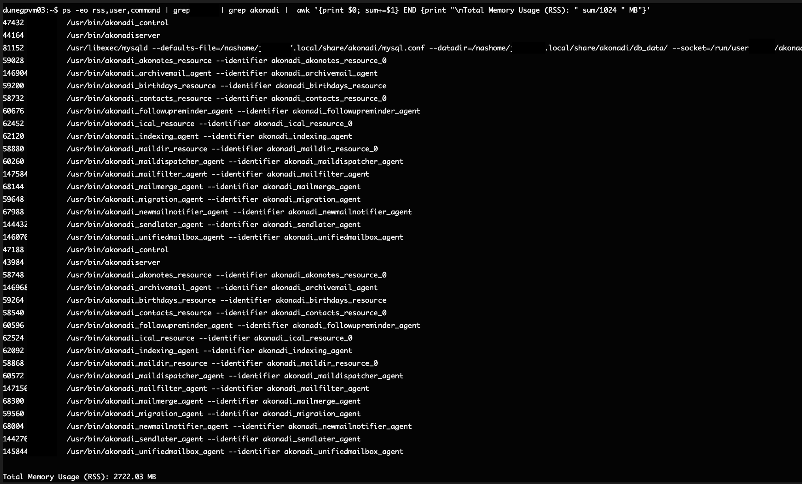



## Interactive resources at Fermilab

Fermilab provides DUNE with 18 virtual machines that are accessible to any DUNE collaborator with a Fermilab Computing account - see [setup]({{ site.baseurl }}/setup) for instruction on getting an account.

### 16 General Purpose Virtual Machines - gpvms

There are 16 `dunegpvm01-dunegpvm16` for everyday use which have 12 GB of memory and 4 CPU's.  These are for developing and testing code, for submitting batch jobs and for running small analysis jobs.  Note that the number of gpvms is likely to decrease in the future as we move to a smaller number of more powerful gpvms.

The default OS on the gpvms is Alma 9; if you need SL7, use the Apptainers described in [SL7 setup]({{ site.baseurl }}/sl7_setup).

They have access to your home area (/nashome/firstletterofusername/username), `/cvmfs/` and the `/exp/dune/data`, `/exp/dune/app` and `/pnfs/dune`.  There is also a small `/tmp` area. 

Some resources (such as batch systems and `/pnfs/`) require "tokens" to access.  See the [tokens]({{ site.baseurl }}/Tokens) page for more information. 

> ## Etiquette Note
> DUNE interactive resources are shared with all of your collaborators.
>
>It is considered quite rude to run large (> 2) numbers of analysis jobs on a shared gpvm. If you need to run more than 1 or 2, learn to use the [justin batch system](https://dunejustin.fnal.gov/docs).
{: .callout}

You can find out the load on the gpvms [here](https://fifemon.fnal.gov/monitor/d/000000004/experiment-overview?var-experiment=dune&orgId=1&var-pool=dune-global&var-pool=fifebatch&from=now-3h&to=now-5m)

### 2 build machines  

Two specially configured interactive machines have been put in place explicitly to rapidly compile and build large software stacks. Nodes `dunebuild02` and `dunebuild03` have 90GB of memory and 24 CPUs each.  These systems are for building code, not running or testing code. 

The `/exp/dune/app` and `/exp/dune/data` areas are mounted on the build machines so that you can access your code but `/pnfs/` is not. 

### Elastic Analysis Facility  

For sophisticated data analysis that needs more memory (i.e. data analysis rather than reconstruction) and/or GPU's, the [Elastic Analysis Facility](https://eafdocs.fnal.gov/) may be what you need.  The EAF supports Jupyter notebooks and has access to GPU's including NVidia A100's. The EAF requires using the [Fermilab VPN](https://fermi.servicenowservices.com/kb_view.do?sysparm_article=KB0010655) or [setting up a proxy](https://eafdocs.fnal.gov/).  

## Interactive resources at CERN

Users with CERN credentials can also use `lxplus`.  See [lxplus.cern.ch](https://abpcomputing.web.cern.ch/computing_resources/lxplus/) for instructions. There are  instructions for using `lxplus` to do development similar to the gpvms in the [CERN setup]({{ site.baseurl }}/setup.html#set-up-on-cern-machines) section of these tutorials. 

## Remote connections

People wishing to use remote connections via VSCode or tunnels for virtual desktops shall follow the instruction in the DUNE wiki linked below. 

[Using tigervnc to get X running on a gpvm](https://wiki.dunescience.org/wiki/DUNE_Computing/Using_VNC_Connections_on_the_dunegpvms)

[Using VSCode on a gpvm without running all your extensions](https://wiki.dunescience.org/wiki/DUNE_Computing/VSCode_and_Claude_on_the_GPVMs)

Do not use other VNC clients that set up a full desktop manager (e.g. Ubuntu/gnome WM, etc ) and only use lightweight VNCs. There are limited resources on the GPVMs. We don't need N instances of your calendar app running on our development machines. Especially as they tend to stay around for weeks, and in some cases, have been observed to consume over 2 GB of memory!

It is also important to disable a number of the background processes related to virtual desktops. There are detailed instructions on the DUNE Wiki:

[Disabling GNOME-related background services (these can turn on even if using IceWM unless they are disabled)](https://wiki.dunescience.org/wiki/DUNE_Computing/Using_VNC_Connections_on_the_dunegpvms#Disabling_some_gnome-related_services)

Don't believe this is a problem? Check out the documented memory usage on a dunegpvm from August 2026:

{: .image-with-shadow }

## Be mindful of computer security

Most of our standard physics code is vetted and tested and is available from `cvmfs` on all of these machines. Be very cautious about downloading and installing untested packages from the internet. Major software sources such as PyPI and conda-forge monitor for malicious code but can't stop everything.  And even legit software can have unexpected resource needs that may not be workable on our systems.  

Installation of rogue software can result in  you, or worse, the collaboration losing computing privileges. 

As a reminder, the Fermilab Policy on Computing Can be Found [here](https://fermi.servicenowservices.com/kb_view.do?sysparm_article=KB0013868). The CERN computing rules are [here](https://security.web.cern.ch/rules/en/index.shtml).
